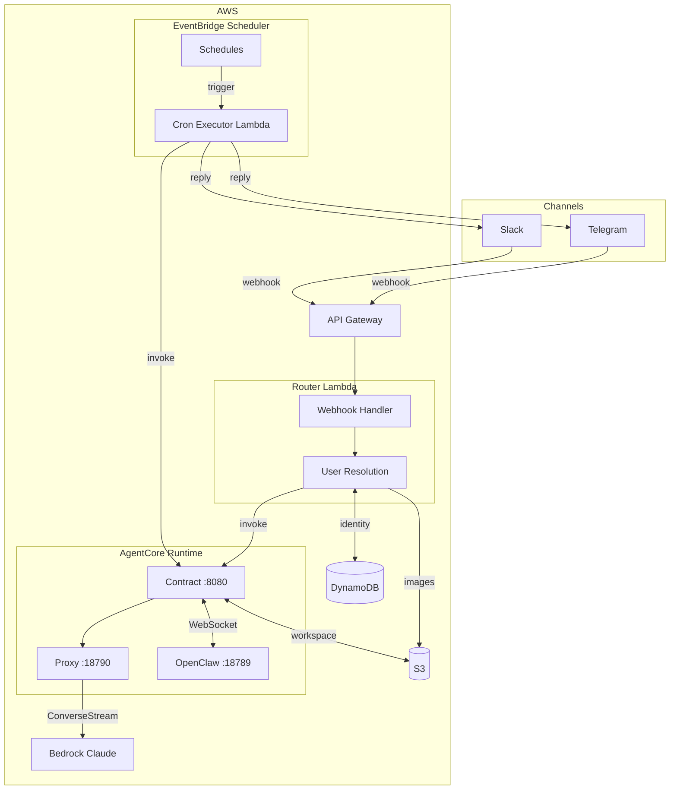
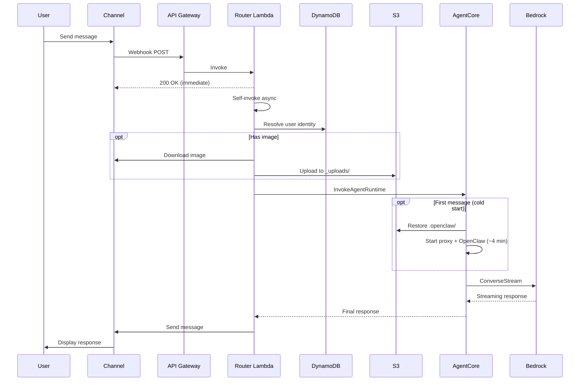
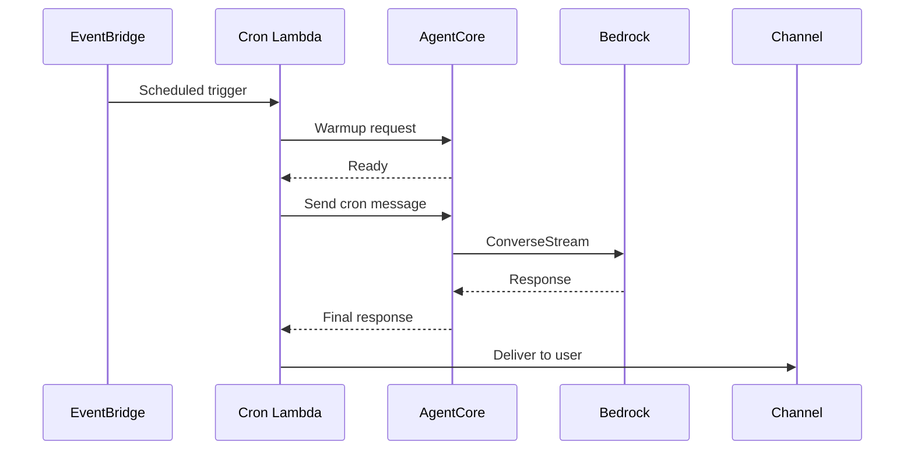
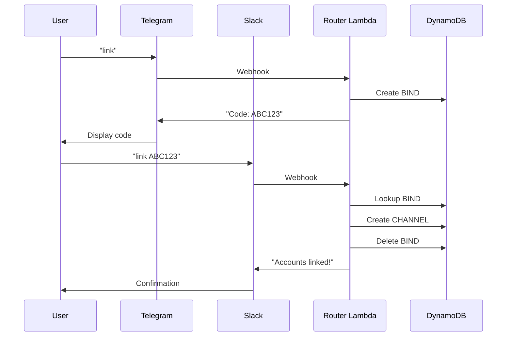

# Detailed Technical Architecture

This document provides a detailed technical view of the OpenClaw on AgentCore architecture. For a high-level overview, see the [README](../README.md#architecture).

## Component Diagram



## Component Details

| Component | Port | Purpose |
|---|---|---|
| **Contract Server** | 8080 | AgentCore HTTP contract (`/ping`, `/invocations`), lazy initialization, WebSocket bridge |
| **Bedrock Proxy** | 18790 | OpenAI-compatible API → Bedrock ConverseStream, Cognito identity, multimodal image handling |
| **OpenClaw Gateway** | 18789 | Headless AI agent with tools and skills |

## Data Flow

### Message Flow (User → Agent → Response)



### Cron Job Flow (Scheduled Task)



### Cross-Channel Account Linking



## Container Internals

```
┌─────────────────────────────────────────────────────────────────┐
│  AgentCore MicroVM (ARM64, per-user)                            │
│                                                                 │
│  ┌─────────────────────────────────────────────────────────┐   │
│  │  Contract Server (:8080)                                 │   │
│  │  - GET /ping → Healthy                                   │   │
│  │  - POST /invocations {action: chat|warmup|status|cron}   │   │
│  │  - Lazy init: restore workspace, start proxy + OpenClaw  │   │
│  │  - SIGTERM: save workspace, cleanup                      │   │
│  └──────────────────────┬──────────────────────────────────┘   │
│                         │                                       │
│         ┌───────────────┴───────────────┐                      │
│         │                               │                      │
│  ┌──────▼──────┐              ┌─────────▼─────────┐            │
│  │ Proxy       │              │ OpenClaw Gateway  │            │
│  │ (:18790)    │◄────────────►│ (:18789)          │            │
│  │             │  WebSocket   │                   │            │
│  │ - OpenAI    │              │ - Headless mode   │            │
│  │   compat    │              │ - Full tools      │            │
│  │ - Bedrock   │              │ - Custom skills   │            │
│  │   Converse  │              │   - s3-user-files │            │
│  │ - Cognito   │              │   - eventbridge-  │            │
│  │   identity  │              │     cron          │            │
│  └──────┬──────┘              └───────────────────┘            │
│         │                                                       │
└─────────┼───────────────────────────────────────────────────────┘
          │
          ▼
    Amazon Bedrock
    ConverseStream API
```

## S3 Bucket Structure

```
s3://openclaw-user-files-{account}-{region}/
├── telegram_6087229962/           # User namespace (channel_id)
│   ├── .openclaw/                 # Workspace (synced on init/shutdown)
│   │   ├── openclaw.json
│   │   ├── MEMORY.md
│   │   ├── USER.md
│   │   └── ...
│   ├── _uploads/                  # Image uploads (from Router Lambda)
│   │   ├── img_1709012345_a1b2.jpeg
│   │   └── ...
│   └── documents/                 # User files (via s3-user-files skill)
│       └── notes.md
├── slack_U12345678/
│   └── ...
└── ...
```

## DynamoDB Schema

**Table: `openclaw-identity`**

| PK | SK | Purpose | TTL |
|---|---|---|---|
| `CHANNEL#telegram:123` | `PROFILE` | Channel → userId mapping | - |
| `USER#user_abc` | `PROFILE` | User profile | - |
| `USER#user_abc` | `CHANNEL#telegram:123` | User's bound channels | - |
| `USER#user_abc` | `SESSION` | Current AgentCore session ID | - |
| `USER#user_abc` | `CRON#reminder-1` | Cron schedule metadata | - |
| `BIND#ABC123` | `BIND` | Cross-channel bind code | 10 min |
| `ALLOW#telegram:123` | `ALLOW` | User allowlist entry | - |

## Security Architecture

See [SECURITY.md](../SECURITY.md) for comprehensive security documentation.

**Key controls:**
- VPC isolation with 7 VPC endpoints
- Webhook signature validation (Telegram + Slack)
- Per-user microVM isolation
- KMS encryption at rest
- Least-privilege IAM with cdk-nag enforcement
